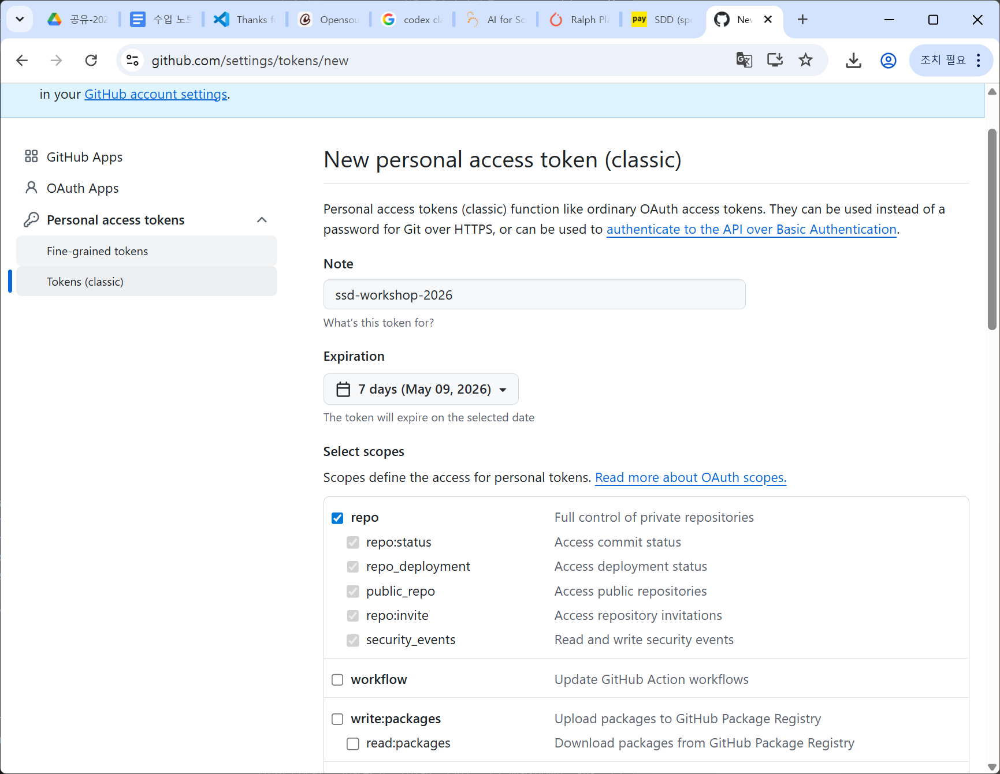

# Git / GitHub 기초

이 문서는 Git과 GitHub를 처음 접하는 수강생을 위한 최소 필수 개념 정리입니다.

## Git과 GitHub는 무엇이 다른가

### Git

내 컴퓨터에서 파일 변경 이력을 기록하는 버전 관리 도구입니다.

- 누가 어떤 파일을 언제 바꿨는지 기록합니다.
- 과거 상태로 되돌아가거나 비교할 수 있습니다.
- 브랜치를 만들어 안전하게 실험할 수 있습니다.

### GitHub

Git 저장소를 인터넷에 올려 공유하고 협업하는 서비스입니다.

- 원격 저장소를 보관합니다.
- 다른 사람과 이력을 공유할 수 있습니다.
- 이슈, PR, Actions 같은 협업 도구를 제공합니다.

## 자주 쓰는 용어

### 저장소 Repository

프로젝트 파일과 변경 이력이 들어 있는 폴더입니다.

### 커밋 Commit

현재 변경 상태를 한 덩어리로 기록하는 것입니다.

커밋 메시지는 "무엇을 왜 바꿨는가"를 짧게 설명해야 합니다.

### 브랜치 Branch

현재 코드의 분기선입니다.

- `main`은 대표 줄기입니다.
- 기능 추가나 수정은 별도 브랜치에서 합니다.
- 검토가 끝난 뒤 `main`에 합칩니다.

### Merge

한 브랜치의 변경을 다른 브랜치에 합치는 작업입니다.

이번 과정에서는 `git merge --no-ff`를 사용합니다. 이유는 merge commit을 남겨서 "언제 어떤 설계 합의가 main에 반영됐는가"를 기록하기 위해서입니다.

### Push

내 컴퓨터의 Git 기록을 GitHub 같은 원격 저장소로 올리는 작업입니다.

### Clone

원격 저장소를 내 컴퓨터로 복사해 오는 작업입니다.

## git token 발행



## HTTPS + PAT가 왜 필요한가

이번 과정은 SSH 대신 HTTPS 방식을 사용합니다.

이유는 다음과 같습니다.

- 교육장이나 회사 네트워크에서 SSH 포트가 막혀 있을 수 있습니다.
- HTTPS는 보통 443 포트를 사용하므로 연결 가능성이 높습니다.
- Windows 환경에서는 Git Credential Manager가 인증 정보를 비교적 쉽게 관리합니다.

PAT는 `Personal Access Token`의 줄임말입니다.

- GitHub 비밀번호를 직접 사용하는 대신 발급받는 개인용 인증 토큰입니다.
- Git push, clone 같은 HTTPS 인증 시 비밀번호 대신 사용합니다.

## 가장 자주 쓰는 Git 명령어

```powershell
git status
git add <file-or-folder>
git commit -m "docs: add day 1 notes"
git branch
git checkout -b feat/example
git merge --no-ff feat/example -m "merge: feat/example"
git log --oneline --graph
git push origin main
```

## 명령어를 읽는 법

### `git status`

현재 어떤 파일이 바뀌었는지 보여줍니다. 실습 중 가장 자주 확인해야 하는 명령어입니다.

### `git add <file-or-folder>`

지정한 파일이나 폴더만 커밋 후보 영역인 staging area에 올립니다.

초심자일수록 `git add .`처럼 전체를 한 번에 올리기보다, `git status`를 먼저 보고 필요한 파일만 선택적으로 올리는 습관이 더 안전합니다.

### `git commit -m "메시지"`

staging area에 올린 변경을 기록합니다.

### `git checkout -b 브랜치명`

새 브랜치를 만들고 그 브랜치로 바로 이동합니다.

### `git merge --no-ff 브랜치명 -m "메시지"`

지정 브랜치의 작업을 현재 브랜치에 합칩니다. `--no-ff`는 merge 흔적을 명확히 남깁니다.

## 초보자가 가장 많이 헷갈리는 지점

### `add`와 `commit`의 차이

- `add`: 커밋할 후보로 올리는 단계
- `commit`: 실제 이력으로 남기는 단계

### `GitHub에 파일이 있다`와 `내 컴퓨터 Git 기록이 있다`의 차이

- GitHub에 있다는 것은 원격 저장소에 올라간 상태입니다.
- 내 컴퓨터에만 커밋되어 있으면 아직 다른 사람은 볼 수 없습니다.
- 이 상태를 원격으로 올리는 것이 `push`입니다.

### 브랜치를 만드는 이유

브랜치를 만들면 `main`을 직접 건드리지 않고 안전하게 작업할 수 있습니다.

예를 들어 `feat/todo-tag` 브랜치에서 실패하더라도 `main`은 그대로 유지됩니다.

## 실습 전에 꼭 확인할 것

1. 현재 로그인한 GitHub 계정이 맞는지 확인합니다.
2. PAT를 안전한 곳에 보관합니다.
3. `git status` 결과를 읽을 수 있어야 합니다.
4. `main` 브랜치와 작업 브랜치를 구분할 수 있어야 합니다.

## 한 문장 정리

Git은 `내 컴퓨터의 변경 이력 관리자`, GitHub는 `그 이력을 공유하는 원격 공간`입니다.