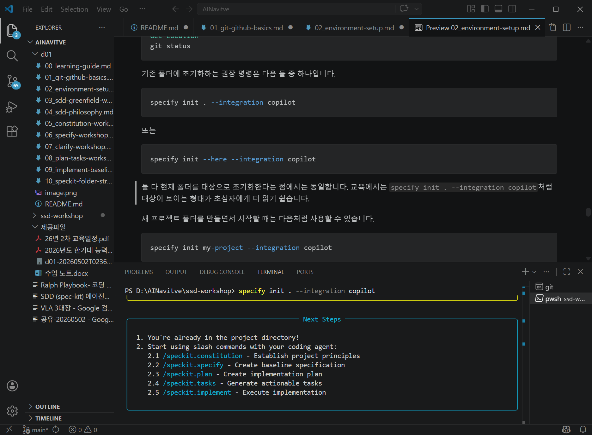

# 1일차 실습 1: 환경 설정

이 문서는 Windows 기준으로 작성되었습니다.

## 목표

- Git, Python, uv, VS Code, Copilot 환경을 준비한다.
- GitHub PAT를 발급한다.
- HTTPS 방식으로 GitHub 저장소를 clone 한다.
- Spec Kit 초기화를 수행한다.

## 전체 순서

1. GitHub PAT 발급
2. Git 최신 버전 설치 및 공용 PC 클린 셋업
3. uv 최신 버전 설치
4. uv를 통한 Python 3.12 설치
5. VS Code 및 확장 확인
6. 실습 폴더 생성
7. GitHub 리포지터리 생성
8. HTTPS로 clone
9. venv 생성 및 활성화
10. Spec Kit 초기화
11. 첫 커밋 및 push

## 1. GitHub PAT 발급

### 왜 필요한가

HTTPS로 GitHub에 push 하려면 인증이 필요합니다. 비밀번호 대신 PAT를 사용합니다.

### `Fine-grained tokens`와 `Tokens (classic)` 중 무엇을 선택해야 하나

GitHub에서는 두 종류의 PAT를 만들 수 있습니다.

### `Tokens (classic)`

초보자 교육 환경에서는 보통 이 방식을 가장 이해하기 쉽습니다.

- 설정해야 할 항목이 적습니다.
- 권한 선택이 단순합니다.
- 개인 실습 저장소를 만들고 clone, commit, push 하는 용도로 설명하기 쉽습니다.

이번 교육처럼 `내 GitHub 계정에 개인 실습용 저장소를 만들고`, `HTTPS로 clone/push` 하며, `GitHub Actions나 조직 정책을 복잡하게 다루지 않는` 경우에는 `Tokens (classic)`을 기본 권장으로 봐도 됩니다.

### `Fine-grained tokens`

더 최신 방식이며, 최소 권한 원칙에 더 잘 맞습니다.

- 어떤 저장소에만 접근할지 세밀하게 제한할 수 있습니다.
- 어떤 기능만 허용할지 더 구체적으로 정할 수 있습니다.
- 조직이나 회사 정책에서 classic token보다 fine-grained token을 권장하거나 강제할 수 있습니다.

다만 초심자 입장에서는 아래 항목이 더 어렵게 느껴질 수 있습니다.

- `Resource owner`를 골라야 합니다.
- 어떤 저장소만 허용할지 선택해야 합니다.
- 권한 이름을 하나씩 찾아 설정해야 합니다.

### 실무/교육 기준 추천

- 개인 계정에서 실습용 저장소 1개를 만들고 따라가는 수업이면: `Tokens (classic)` 권장
- 회사/조직 정책상 classic token 사용이 제한되거나, 최소 권한 원칙을 엄격히 적용해야 하면: `Fine-grained tokens` 선택

정리하면, `처음 GitHub PAT를 접하는 교육생에게 가장 설명하기 쉬운 것은 classic`, `보안 정책과 최소 권한 측면에서 더 바람직한 것은 fine-grained`입니다.

### 발급 절차

1. GitHub에 로그인합니다.
2. 우측 상단 프로필 이미지를 클릭합니다.
3. `Settings`를 엽니다.
4. 좌측 메뉴에서 `Developer settings`를 엽니다.
5. `Personal access tokens`를 선택합니다.
6. `Personal access tokens` 아래에서 사용할 토큰 종류를 선택합니다.
7. 아래 안내에 따라 `Tokens (classic)` 또는 `Fine-grained tokens` 생성 화면으로 이동합니다.
8. 화면 항목을 입력하고 권한을 설정합니다.
9. 토큰을 생성합니다.
10. 생성 직후 값을 복사해 안전한 곳에 저장합니다.

주의: 토큰은 생성 직후 한 번만 전체 값을 볼 수 있는 경우가 많습니다.

### A안: `Tokens (classic)`으로 만드는 방법

초심자 기준으로 가장 단순한 방법입니다.

1. `Developer settings -> Personal access tokens -> Tokens (classic)`으로 이동합니다.
2. `Generate new token` 또는 `Generate new token (classic)`을 클릭합니다.
3. GitHub가 비밀번호 재확인을 요구하면 로그인 절차를 완료합니다.
4. 토큰 생성 화면에서 아래 항목을 입력합니다.

#### 1) `Note`

토큰의 용도를 적는 칸입니다. 나중에 토큰 목록에서 구분하기 쉽도록 적습니다.

입력 예시:

- `sdd-workshop-2026`
- `ai-native-sdd-training`

#### 2) `Expiration`

토큰 만료일을 정합니다.

교육용 권장:

- 하루짜리 수업만 위한 임시 토큰이면 `7 days` 또는 `30 days`
- 이후에도 복습용으로 잠시 쓸 계획이면 `30 days` 또는 `60 days`

너무 길게 두는 것은 권장하지 않습니다. 교육이 끝나면 삭제하거나 만료시키는 편이 안전합니다.

#### 3) `Select scopes`

여기서 체크박스로 권한을 고릅니다.

개인 실습 저장소를 clone, push 하는 목적이라면 보통 아래처럼 설정하면 충분합니다.

- `repo`: 체크

`repo` 하나에 개인 저장소 작업에 필요한 대부분의 권한이 포함됩니다.

추가로 아래는 필요한 경우에만 검토합니다.

- `workflow`: 보통은 체크하지 않아도 됨

`workflow`가 필요한 경우:

- `.github/workflows/` 아래 GitHub Actions 워크플로 파일을 새로 만들거나 수정해서 push 해야 하는 경우

이번 교육 자료 기준으로는 일반적으로 `repo`만으로 충분합니다.

다음 권한은 보통 불필요합니다.

- `delete_repo`
- `admin:org`
- `gist`
- `notifications`
- `write:packages`

#### classic token 권장 설정 요약

- `Note`: `sdd-workshop-2026`
- `Expiration`: `30 days`
- `Scopes`: `repo`만 체크
- 필요 시만 추가: `workflow`

### B안: `Fine-grained tokens`으로 만드는 방법

조직 정책상 classic token을 쓰기 어렵거나, 저장소별 최소 권한을 엄격히 적용해야 하면 이 방식을 사용합니다.

1. `Developer settings -> Personal access tokens -> Fine-grained tokens`로 이동합니다.
2. `Generate new token`을 클릭합니다.
3. 비밀번호 재확인 또는 추가 인증이 필요하면 완료합니다.
4. 아래 항목을 순서대로 입력합니다.

#### 1) `Token name`

토큰 용도를 적습니다.

입력 예시:

- `sdd-workshop-2026-fg`

#### 2) `Description`

선택 항목이라면 목적을 간단히 적습니다.

입력 예시:

- `PAT for SDD workshop repository over HTTPS`

#### 3) `Expiration`

classic과 동일하게 짧게 두는 편이 좋습니다.

권장 예시:

- `30 days`

#### 4) `Resource owner`

이 토큰이 어느 계정 또는 조직의 저장소에 접근할지 정하는 항목입니다.

개인 실습 저장소라면 보통 `본인 GitHub 계정`을 선택합니다.

주의:

- 회사 조직 저장소를 사용한다면 그 조직이 fine-grained token을 허용해야 합니다.
- 조직 저장소는 승인 절차가 필요할 수 있습니다.

#### 5) `Repository access`

어떤 저장소에 접근할지 고릅니다.

개인 실습용 권장:

- `Only select repositories`

그리고 목록에서 실습 저장소만 선택합니다.

예시:

- `sdd-workshop`

이렇게 하면 다른 저장소에는 접근하지 못하므로 더 안전합니다.

#### 6) `Permissions`

여기서 가장 중요한 것은 `Repository permissions`입니다.

개인 실습 저장소를 HTTPS로 clone 하고 push 하는 최소 권한 예시는 보통 다음과 같습니다.

- `Contents`: `Read and write`
- `Metadata`: 보통 자동으로 `Read-only`가 포함되며 별도 수정 불가인 경우가 많음

상황에 따라 검토할 수 있는 추가 권한:

- `Pull requests`: 이번 교육에서는 보통 불필요
- `Actions` 또는 `Workflows` 관련 권한: `.github/workflows/`를 수정해야 하는 경우에만 필요할 수 있음

이번 문서 기준으로는 일반적으로 아래 설정을 우선 권장합니다.

- `Repository access`: `Only select repositories -> sdd-workshop`
- `Repository permissions -> Contents`: `Read and write`

다른 권한은 기본값 또는 미부여 상태로 두는 편이 안전합니다.

#### fine-grained token 권장 설정 요약

- `Token name`: `sdd-workshop-2026-fg`
- `Expiration`: `30 days`
- `Resource owner`: 본인 GitHub 계정
- `Repository access`: `Only select repositories`
- 선택 저장소: `sdd-workshop`
- `Repository permissions`: `Contents = Read and write`

### 어떤 권한이 실제로 필요한지 판단하는 기준

#### 저장소를 clone만 할 것인가

- `Read` 권한만으로 충분할 수 있습니다.

#### clone + commit + push까지 할 것인가

- 쓰기 권한이 필요합니다.
- classic이면 보통 `repo`
- fine-grained면 보통 `Contents: Read and write`

#### GitHub Actions 워크플로 파일까지 수정할 것인가

- classic이면 `workflow`가 추가로 필요할 수 있습니다.
- fine-grained면 `Actions` 또는 `Workflows` 관련 권한이 필요할 수 있습니다.

이번 교육의 기본 실습 범위에서는 대개 여기까지는 필요하지 않습니다.

### 초심자를 위한 최종 권장안

#### 가장 쉬운 선택

- `Tokens (classic)` 선택
- `Note`: `sdd-workshop-2026`
- `Expiration`: `30 days`
- `Scopes`: `repo`만 체크

#### 더 안전하게 제한하고 싶을 때

- `Fine-grained tokens` 선택
- `Resource owner`: 본인 계정
- `Repository access`: `Only select repositories`
- 저장소: `sdd-workshop`
- `Contents`: `Read and write`

### 생성 후 꼭 해야 할 일

1. 생성 직후 토큰 값을 복사합니다.
2. 메모장이나 사내 승인된 비밀 저장 수단에 임시 보관합니다.
3. VS Code 또는 Git 인증 창에서 비밀번호 대신 붙여 넣습니다.
4. 실습 종료 후 더 이상 필요 없으면 토큰을 삭제하거나 만료시킵니다.

## 2. Git 최신 버전 설치 및 공용 PC 클린 셋업

실습실의 공용 PC에서는 `이미 설치된 Git 설정`, `이전 사용자의 GitHub 인증 정보`, `잘못된 사용자 이름/이메일` 때문에 push 단계에서 문제가 자주 생깁니다.

그래서 이번 과정에서는 `최신 Git 설치 확인 -> 인증 흔적 점검 -> 현재 실습 저장소 기준으로 사용자 정보 다시 설정` 순서로 진행하는 것을 권장합니다.

### 2-1. 왜 Git을 먼저 정리해야 하나

공용 PC에서는 아래 문제가 흔합니다.

- 예전 수강생 GitHub 계정으로 인증이 남아 있음
- `git config --global`에 다른 사람 이름과 이메일이 저장되어 있음
- Git Credential Manager에 이전 토큰이 남아 있음
- Git 버전이 너무 오래되어 인증 창이나 HTTPS 동작이 불안정함

이 상태로 바로 실습하면, `내 계정으로 push했다고 생각했는데 다른 계정으로 인증되는` 문제가 생길 수 있습니다.

### 2-2. 최신 Git 설치

1. 브라우저에서 `https://git-scm.com/download/win`에 접속합니다.
2. 최신 `Git for Windows` 설치 파일을 다운로드합니다.
3. 설치 마법사를 실행합니다.

대부분 기본값으로 진행해도 되지만, 아래 항목은 특히 확인합니다.

#### 설치 중 확인할 항목

- `Choosing the default editor used by Git`
	- 권장: `Use Visual Studio Code as Git's default editor`
	- VS Code가 없다면 기본값 유지 가능

- `Adjusting the name of the initial branch in new repositories`
	- 권장: `Let Git decide` 또는 교육 표준에 맞게 `main`

- `Adjusting your PATH environment`
	- 권장: `Git from the command line and also from 3rd-party software`

- `Choosing HTTPS transport backend`
	- 권장: 기본값 유지

- `Configuring the line ending conversions`
	- 권장: 기본값 유지

- `Choosing the terminal emulator to use with Git Bash`
	- 이번 교육은 VS Code PowerShell 중심이므로 기본값 유지 가능

- `Choose a credential helper`
	- 매우 중요: `Git Credential Manager`가 포함되도록 유지

### 2-3. 설치 후 버전 확인

VS Code 터미널 또는 PowerShell에서 아래를 실행합니다.

```powershell
git --version
```

예상 결과 예시:

```text
git version 2.4x.x.windows.x
```

버전 숫자는 시점에 따라 달라질 수 있습니다. 중요한 것은 `오래된 사내 이미지 Git`가 아니라 `최근 Git for Windows`가 동작하는지입니다.

### 2-4. 공용 PC용 클린 체크

설치가 끝났더라도 바로 실습하지 말고 아래를 먼저 확인합니다.

#### 1) 전역 Git 설정 확인

```powershell
git config --global --list
```

확인할 항목:

- `user.name`
- `user.email`
- `credential.helper`

여기서 이전 사용자의 이름과 이메일이 보일 수 있습니다.

중요:

- 공용 PC에서는 다른 사람의 전역 설정을 함부로 지우기보다, `내 실습 저장소 안에서만 로컬 설정`을 다시 잡는 편이 더 안전합니다.
- 다만 명백히 실습용 공용 이미지이고 초기화가 허용된 환경이라면 강사 지침에 따라 정리할 수 있습니다.

#### 2) GitHub 인증이 남아 있는지 점검

공용 PC에서는 Windows 자격 증명 관리자에 이전 사용자의 GitHub 인증 정보가 남아 있을 수 있습니다.

확인 방법:

1. Windows 시작 메뉴에서 `자격 증명 관리자`를 검색해 엽니다.
2. `Windows 자격 증명`으로 이동합니다.
3. `git:https://github.com` 또는 GitHub 관련 항목이 있는지 확인합니다.

이전 사용자 계정으로 추정되는 항목이 있으면, 강의 운영 방침에 따라 삭제 후 본인 계정으로 다시 인증하는 것이 안전합니다.

주의:

- 조직 PC 정책상 자격 증명 삭제가 제한될 수 있습니다.
- 이런 경우에는 강사 또는 실습실 관리자 지침을 우선합니다.

#### 3) 현재 저장소에서는 로컬 사용자 정보 사용

clone 후 저장소 폴더 안에서 아래처럼 `로컬 설정`을 권장합니다.

```powershell
git config user.name "홍길동"
git config user.email "your-email@example.com"
```

이 명령은 `현재 저장소에만` 적용되므로, 공용 PC에서 다른 실습에 영향을 덜 줍니다.

확인:

```powershell
git config --list --show-origin
```

여기서 `.git\config`에 `user.name`, `user.email`이 들어 있으면 현재 저장소 기준 설정이 잘 들어간 것입니다.

### 2-5. 공용 PC에서 권장하는 Git 운영 원칙

- 가능하면 `--global`보다 저장소 단위 설정을 우선합니다.
- GitHub 인증은 본인 계정으로 다시 확인합니다.
- 실습 종료 후 로그아웃 또는 자격 증명 정리를 검토합니다.
- 다른 사람 계정 정보가 보이면 임의 수정 전에 강사 지침을 따릅니다.

## 3. uv 최신 버전 설치 및 확인

이번 과정에서는 `uv`를 패키지/환경 관리 도구로 사용합니다.

공식 문서 기준으로 `uv`는 Windows에서 PowerShell 설치 스크립트로 설치할 수 있고, 기본적으로 가상환경 사용을 전제로 동작합니다. 즉, 시스템 Python에 마구 설치하기보다 `.venv` 같은 분리된 환경을 기본으로 쓰는 흐름에 잘 맞습니다.

### 3-1. 설치 전 확인

먼저 이미 설치되어 있는지 확인합니다.

```powershell
uv --version
```

정상 버전이 나오면 기존 설치를 그대로 사용할지, 교육 환경 통일을 위해 재설치할지 강사 지침을 따릅니다.

### 3-2. Windows PowerShell로 최신 uv 설치

공식 설치 예시는 다음과 같습니다.

```powershell
powershell -ExecutionPolicy ByPass -c "irm https://astral.sh/uv/install.ps1 | iex"
```

보안상 스크립트 내용을 먼저 보고 싶다면:

```powershell
powershell -c "irm https://astral.sh/uv/install.ps1 | more"
```

### 3-3. 설치 후 확인

```powershell
uv --version
```

`uv`가 정상 설치되면 다음 단계에서 Python 3.12도 uv로 직접 설치합니다.

### 3-4. 왜 uv를 쓰는가

- 설치와 실행 속도가 빠릅니다.
- 가상환경 중심 흐름과 잘 맞습니다.
- 이후 `uv run`, `uv pip`, `uv sync` 같은 명령으로 교육을 확장하기 쉽습니다.

## 4. uv를 통한 Python 3.12 설치 및 확인

이번 과정은 `Python도 uv를 통해 3.12를 설치하는 것`을 기준으로 진행합니다.

즉, 설치 순서는 아래처럼 이해하면 됩니다.

- 먼저 `uv`를 설치한다.
- 그 다음 `uv`로 `Python 3.12`를 설치한다.
- 이후 해당 Python을 이용해 `.venv`를 만든다.

### 4-1. 왜 이 방식을 쓰는가

- Python 버전을 교육 기준으로 통일하기 쉽습니다.
- 공용 PC에 이미 깔린 오래된 Python과 충돌할 가능성을 줄일 수 있습니다.
- `uv`, `Python`, `.venv` 흐름이 하나의 도구 체계로 정리됩니다.

### 4-2. Python 3.12 설치

아래 명령으로 Python 3.12를 설치합니다.

```powershell
uv python install 3.12
```
```warning 뜨는 경우 force option주고 설치 
uv python install 3.12 --force
```

설치가 완료되면 uv가 관리하는 Python 3.12 실행 파일을 사용할 수 있습니다.

### 4-3. 설치 확인

아래 명령으로 설치된 Python 목록 또는 버전을 확인합니다.

```powershell
uv python list
```

또는 버전 실행 확인 예시:

```powershell
uv run --python 3.12 python --version
```

목표 예시:

```text
Python 3.12.x
```

### 4-4. 기존 시스템 Python과 구분해서 이해할 것

공용 PC에는 아래 상황이 동시에 있을 수 있습니다.

- Windows 또는 다른 프로그램이 설치한 기존 Python
- 예전 수강생이 설치한 Python
- uv가 새로 관리하는 Python 3.12

이번 실습에서 중요한 것은 `시스템 전체에서 어떤 python.exe가 먼저 잡히는가`보다, `uv와 .venv가 우리가 원하는 Python 3.12 기준으로 동작하는가`입니다.

즉, `where python` 결과가 여러 개여도, 이후 `.venv`를 우리가 의도한 Python 3.12로 만들면 실습은 안정적으로 진행할 수 있습니다.

### 4-5. 설치 후 확인 체크

- `uv --version`이 정상 출력된다.
- `uv python install 3.12`가 성공한다.
- `uv python list`에서 3.12 계열이 보인다.
- `uv run --python 3.12 python --version`이 `Python 3.12.x`를 출력한다.

## 5. VS Code와 확장 확인

VS Code에서 `Ctrl+Shift+X`를 눌러 Extensions 패널을 열고 다음 항목을 확인합니다.

- GitHub Copilot Chat
- Python
- Pylance
- 필요 시 Markdown 관련 확장

## 6. 실습 폴더 준비

터미널에서 원하는 작업 위치로 이동합니다.

```powershell
mkdir sdd-labs
cd sdd-labs
```

이미 폴더가 있다면 기존 폴더를 재사용해도 됩니다.

## 7. GitHub 리포지터리 생성

GitHub 웹에서 새 저장소를 만듭니다.

권장 설정:

- Repository name: `sdd-workshop`
- Public 또는 교육 정책에 맞는 Private
- `Initialize this repository with a README`는 체크하지 않음

이유: 로컬에서 Spec Kit 초기화 후 첫 커밋을 만들기 위함입니다.

## 8. HTTPS로 clone

GitHub 저장소 화면에서 `Code` 버튼을 누르고 HTTPS URL을 복사합니다.

예시:

```powershell
git clone https://github.com/<your-id>/sdd-workshop.git
cd sdd-workshop
```

`<your-id>`는 실제 본인 계정으로 바꿉니다.

clone 직후, 공용 PC에서는 현재 저장소에만 사용자 정보를 설정하는 것을 권장합니다.

```powershell
git config user.name "홍길동"
git config user.email "your-email@example.com"
```

## 9. venv 생성 및 활성화

이번 교육에서는 프로젝트마다 독립된 `.venv`를 만듭니다.

이유는 다음과 같습니다.

- 공용 PC의 시스템 Python 환경을 더럽히지 않기 위해서
- 프로젝트별 패키지 충돌을 피하기 위해서
- uv와 함께 쓰기 좋은 표준 구조이기 때문에

### 9-1. uv로 설치한 Python 3.12 기준으로 venv 생성

가장 권장하는 방법은 `uv가 관리하는 Python 3.12`를 명시해서 `.venv`를 만드는 것입니다.

```powershell
uv venv --python 3.12
.\.venv\Scripts\Activate.ps1
```

이 방식의 장점은 현재 PC에 다른 Python이 여럿 있어도, 실습용 가상환경을 3.12 기준으로 명확하게 만들 수 있다는 점입니다.

### 9-2. 대안: 기본 venv 생성

```powershell
python -m venv .venv
.\.venv\Scripts\Activate.ps1
```

이 방식은 현재 PATH에 잡힌 Python을 사용하므로, 공용 PC에서는 의도하지 않은 버전이 선택될 수 있습니다. 따라서 이번 교육 기준으로는 `uv venv --python 3.12`가 더 안전합니다.

활성화 후 프롬프트 앞에 `(.venv)`가 보이면 정상입니다.

### 9-3. uv 기본 검색 방식으로 venv 생성하는 방법

uv를 사용하는 환경에서는 다음처럼 만들 수도 있습니다.

```powershell
uv venv
.\.venv\Scripts\Activate.ps1
```

필요 시 pip, setuptools 등을 함께 준비하려면:

```powershell
uv venv --seed
```

초심자 교육에서는 `uv venv --python 3.12`를 기본 표준으로 잡는 편이 가장 일관적입니다.

### 9-4. 활성화 확인

```powershell
python --version
where python
```

가상환경이 정상 활성화되면 `.venv` 경로 쪽 Python이 먼저 잡혀야 합니다.

## 10. Spec Kit 설치 및 초기화

이 문서에서는 `Spec Kit v0.8.3` 기준으로 설명합니다.

중요: Spec Kit은 같은 이름의 비공식 PyPI 패키지가 있을 수 있으므로, 반드시 GitHub 저장소를 직접 지정해서 설치해야 합니다. 교육에서는 `uv` 기반의 고정 버전 설치를 기본값으로 사용합니다.

### 10-1. 설치 전 확인

Spec Kit 설치 전에 아래 조건이 충족되어야 합니다.

- Git이 설치되어 있어야 합니다.
- Python 3.11 이상이 설치되어 있어야 합니다.
- `uv` 또는 `pipx`를 사용할 수 있어야 합니다.
- Spec Kit을 연결할 AI 에이전트가 정해져 있어야 합니다. 이 과정에서는 VS Code GitHub Copilot 기준으로 `copilot` integration을 사용합니다.

아래 명령으로 빠르게 점검할 수 있습니다.

```powershell
git --version
python --version
uv --version
```

만약 `uv`를 쓰지 않고 `pipx`를 사용할 계획이라면 다음도 확인합니다.

```powershell
pipx --version
```

### 10-2. 권장 설치: `uv tool install`

가장 권장되는 방법은 `uv tool install`로 `specify-cli`를 고정 버전 설치하는 것입니다.

```powershell
uv tool install specify-cli --from git+https://github.com/github/spec-kit.git@v0.8.3
```

이 방식의 장점은 다음과 같습니다.

- 한 번만 설치하면 여러 프로젝트에서 계속 사용할 수 있습니다.
- `specify` 명령이 PATH에 등록되어 재사용이 쉽습니다.
- 교육 자료와 동일한 버전으로 맞추기 쉽습니다.

설치가 끝나면 버전을 확인합니다.

```powershell
specify version
```

출력에 `0.8.3`이 보이면 정상입니다.

설치된 CLI와 사용 가능한 구성 요소를 확인하려면 다음 명령도 유용합니다.

```powershell
specify check
specify integration list
```

### 10-3. 대안 설치: `pipx`

환경에 따라 `uv` 대신 `pipx`를 써도 됩니다.

```powershell
pipx install git+https://github.com/github/spec-kit.git@v0.8.3
```

마찬가지로 설치 후 버전을 확인합니다.

```powershell
specify version
```

### 10-4. 일회성 실행: `uvx`

교육이나 체험 목적으로 설치 없이 한 번만 실행하고 싶다면 `uvx`도 가능합니다.

```powershell
uvx --from git+https://github.com/github/spec-kit.git@v0.8.3 specify version
```

다만 실습 과정에서는 같은 명령을 반복해서 쓰게 되므로, 일회성 실행보다 `uv tool install` 방식이 더 적합합니다.

### 10-5. 현재 저장소에서 Spec Kit 초기화

이제 Spec Kit을 현재 Git 저장소에 초기화합니다.

반드시 확인할 점:

- 현재 PowerShell 위치가 Git 저장소 루트여야 합니다.
- 이미 `git init` 또는 GitHub 원격 저장소 연결이 끝난 상태여야 합니다.
- VS Code에서 사용할 integration 이름을 맞춰야 합니다. 이 문서에서는 `copilot`을 사용합니다.

현재 위치를 확인하려면:

```powershell
Get-Location
git status
```

기존 폴더에 초기화하는 권장 명령은 다음 둘 중 하나입니다.

```powershell
specify init . --integration copilot
```

또는

```powershell
specify init --here --integration copilot
```

둘 다 현재 폴더를 대상으로 초기화한다는 점에서는 동일합니다. 교육에서는 `specify init . --integration copilot`처럼 대상이 보이는 형태가 초심자에게 더 읽기 쉽습니다.




새 프로젝트 폴더를 만들면서 시작할 때는 다음처럼 사용할 수 있습니다.

```powershell
specify init my-project --integration copilot
```

### 10-6. 초기화 후 생성되는 것

초기화가 성공하면 보통 다음과 같은 구조가 생깁니다.

- `.specify/`: Spec Kit 템플릿, 워크플로 관련 설정
- `.github/`: 에이전트 또는 프롬프트 연동에 필요한 파일
- 각 integration에 맞는 명령 또는 프롬프트 파일

프로젝트와 integration에 따라 세부 파일 수는 달라질 수 있지만, 핵심은 `Spec Kit 워크플로를 실행할 기본 구조`가 생겨야 한다는 점입니다.

`.github`와 `.specify`의 실제 구조와 역할을 자세히 이해하려면 `10_speckit-folder-structure.md`를 함께 읽는 것이 좋습니다. 이 문서는 agent/prompt/template 파일을 자세히 설명합니다.

### 10-7. 초기화 검증

초기화 직후 아래 순서로 확인합니다.

```powershell
git status
Get-ChildItem -Force
```

여기서 `.specify`, `.github` 같은 새 파일과 폴더가 보이면 정상입니다.

`git status`에서 새로 생성된 파일이 추적 대상로 보이는지도 확인합니다.

### 10-8. 버전 고정 업그레이드 방법

나중에 같은 방식으로 버전을 다시 맞추거나 강제 재설치하려면 다음처럼 실행합니다.

`uv` 사용 시:

```powershell
uv tool install specify-cli --force --from git+https://github.com/github/spec-kit.git@v0.8.3
```

`pipx` 사용 시:

```powershell
pipx install --force git+https://github.com/github/spec-kit.git@v0.8.3
```

중요한 점은 업그레이드할 때도 GitHub URL과 태그를 명시해야 한다는 것입니다.

## 11. 첫 상태 점검

```powershell
git status
```

여기서 생성된 파일이 보이면 정상입니다.

이 단계에서는 바로 `git add .`를 하지 말고, `무엇이 새로 생겼는지`를 먼저 읽어야 합니다.

특히 다음 항목이 보이면 그대로 커밋하면 안 됩니다.

- `.venv/`
- `.env`
- `__pycache__/`
- `node_modules/`
- 테스트 중 생긴 임시 파일

즉, 첫 커밋의 목적은 `Spec Kit 초기화로 생긴 프로젝트 기본 구조`를 기록하는 것이지, 내 로컬 실행 환경 전체를 통째로 올리는 것이 아닙니다.

### 11-1. `.gitignore` 먼저 확인

프로젝트 루트에 `.gitignore`가 있는지 확인합니다.

```powershell
Get-ChildItem -Force
```

만약 `.gitignore`가 없다면, 최소한 아래 항목은 들어가 있어야 합니다.

```gitignore
.venv/
__pycache__/
.env
node_modules/
.DS_Store
Thumbs.db
```

이미 `.gitignore`가 있어도 `git status`에 위 항목이 보이면 ignore 규칙이 충분한지 다시 확인합니다.

## 12. 첫 커밋

처음 커밋할 때는 `git add .`보다 `확인 후 선택적으로 add`하는 습관이 더 안전합니다.

권장 순서는 다음과 같습니다.

```powershell
git status
git add .github .specify .gitignore
git add README.md
git status
git commit -m "chore: initialize spec kit workspace"
git push -u origin main
```

프로젝트에 따라 처음부터 함께 올려야 할 파일이 더 있을 수 있습니다. 중요한 점은 `status를 보고 필요한 파일만 add`하는 것입니다.

만약 아직 추적하면 안 되는 파일이 섞여 있다면, 먼저 `.gitignore`를 고친 뒤 다시 `git status`로 확인합니다.

실수로 너무 많이 staging 했다면 다음 명령으로 staging만 취소할 수 있습니다.

```powershell
git restore --staged .
git status
```

push 시 인증 창이 뜨면 GitHub 아이디와 PAT를 사용합니다.

주의: 비밀번호 입력란처럼 보여도 실제로는 PAT를 붙여 넣어야 할 수 있습니다.

## 13. 확인 체크리스트

- `git status`가 깨끗한 상태인지 확인합니다.
- GitHub 웹에서 방금 커밋이 보이는지 확인합니다.
- `.venv`가 활성화되는지 확인합니다.
- Spec Kit 관련 초기 구조가 생성되었는지 확인합니다.
- `.venv`, `.env`, 캐시 폴더 같은 로컬 전용 파일이 커밋되지 않았는지 확인합니다.

## 자주 발생하는 문제

### `git` 명령이 없다고 나오는 경우

Git 설치 후 VS Code를 완전히 종료했다가 다시 실행합니다.

### PowerShell에서 스크립트 실행이 막히는 경우

회사 보안 정책이나 PowerShell 실행 정책 때문일 수 있습니다. 이 경우 교육에서 제공한 수동 설치 경로를 따릅니다.

### push 인증이 실패하는 경우

- GitHub 계정이 맞는지 확인합니다.
- PAT 권한이 충분한지 확인합니다.
- 기존에 저장된 잘못된 자격 증명이 있는지 확인합니다.

## 다음 단계

환경 준비가 끝났다면 `03_sdd-greenfield-workshop.md`로 이동합니다.